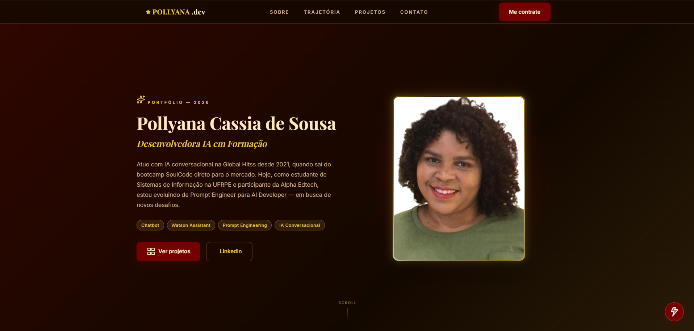

# ⚡ Portfólio Pessoal — Pollyana Cassia de Sousa

Portfólio pessoal estático desenvolvido do zero com HTML, CSS e JavaScript puros, sem uso de frameworks ou bibliotecas externas. Projeto entregue como desafio da **Alpha Edtech — Turma 7**.

---

## 🌐 Aplicação em Produção

👉 **[https://pollyanasousa.github.io/desafio-alpha-edtech-portfolio/](https://pollyanasousa.github.io/desafio-alpha-edtech-portfolio/)**

---

## 📌 Status do Projeto

✅ **Concluído** — Junho/2026

---

## 🎬 Demonstração

> Clique na imagem abaixo para assistir ao vídeo de demonstração:

[](img/Pollyana-PORTIFOLIO.mp4)

---

## 🎨 Protótipo UX/UI

O design foi prototipado no **Google Stitch** antes do desenvolvimento, cobrindo layouts desktop (1440px) e mobile (375px), design system completo com paleta, tipografia e componentes.

> ⚠️ O escopo indicava Figma como ferramenta de prototipagem. O Google Stitch foi utilizado como alternativa, gerando protótipo de alta fidelidade equivalente com todos os frames exigidos.

👉 **[Ver protótipo no Google Stitch](https://stitch.withgoogle.com/projects/17155608820040465400)**

---

## 🛠️ Tecnologias Utilizadas

| Tecnologia | Descrição |
|---|---|
| HTML5 | Estrutura semântica com `header`, `nav`, `main`, `section`, `article`, `footer`, `aside` |
| CSS3 | Variables, Flexbox, Grid, Media Queries, `@keyframes`, `@property` |
| JavaScript Vanilla | Menu mobile, validação de formulário, IntersectionObserver, HermioneBot |
| Google Fonts | Playfair Display + Inter |
| Lucide Icons | Ícones via CDN |
| GitHub Pages | Deploy e hospedagem |
| Google Stitch | Prototipagem UX/UI |

> ⚠️ Projeto desenvolvido sem frameworks CSS (Bootstrap, Tailwind), sem frameworks JS (React, Vue, jQuery) e sem bibliotecas de animação (AOS, ScrollReveal).

---

## 📁 Estrutura de Pastas

```
desafio-alpha-edtech-portfolio/
├── index.html
├── css/
│   └── style.css
├── script.js
├── img/
│   ├── foto3x4.jpeg
│   ├── harrypotter.png
│   ├── icons8-*.png
│   ├── print-hero.png             # Thumbnail do vídeo de demonstração
│   └── Pollyana-PORTIFOLIO.mp4   # Vídeo de demonstração
└── docs/
    └── prompt-uxui.md             # Prompt de engenharia usado no Google Stitch
```

---

## 🚀 Como Rodar Localmente

```bash
# 1. Clone o repositório
git clone https://github.com/pollyanasousa/desafio-alpha-edtech-portfolio.git

# 2. Acesse a pasta
cd desafio-alpha-edtech-portfolio

# 3. Abra no navegador
# Opção A: abra o index.html diretamente no navegador
# Opção B: use a extensão Live Server no VS Code
```

Não requer instalação de dependências — é HTML, CSS e JavaScript puro!

---

## 📄 Seções do Portfólio

- **Hero** — Apresentação com foto, nome, subtítulo, bio, tags e CTAs
- **Sobre Mim** — Trajetória pessoal e barras de habilidades animadas
- **Trajetória** — Timeline vertical com cards alternados (2020–2026)
- **Projetos** — 3 projetos com chips de tecnologia, links de demo e GitHub
- **Contato** — Formulário validado + LinkedIn, GitHub e e-mail
- **HermioneBot** — Chatbot flutuante que responde perguntas frequentes

---

## ✨ Funcionalidades Técnicas

- Animações de entrada com `@keyframes fadeUp` — sem bibliotecas externas
- Barras de skill animadas com `IntersectionObserver`
- Timeline com efeito cascata via `setTimeout` escalonado
- Borda da foto com gradiente dourado girando via `@property --angle`
- Menu mobile com abertura/fechamento via classList
- Validação de formulário em JavaScript puro
- Totalmente responsivo de 320px até 1920px

---

## 👩🏽‍💻 Autora

**Pollyana Cassia de Sousa**  
Desenvolvedora IA em Formação · Prompt Engineer · Watson Assistant

- 💼 [LinkedIn](https://www.linkedin.com/in/pollyanacassia/)
- 🐙 [GitHub](https://github.com/pollyanasousa)
- 📧 pollyanacassia8@gmail.com

---

<p align="center">⚡ Coragem para Codar & Sabedoria para Inovar — 2026</p>